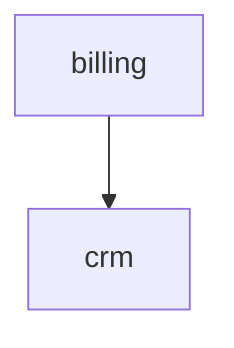

# Spécification générée

Graphe de connaissances des règles métier, extrait du code source par codetospec.

- Domaines : 2
- Entités : 1
- Endpoints : 1
- Règles : 1
  - métier : 1 · présentation : 0 · technique : 0
  - explicites : 1 · implicites : 0

## Couverture

- Endpoints référencés par au moins une règle : 1/1 (100%)
- Entités touchées par au moins une règle : 1/1 (100%)
- Chunks en échec : 1/5
- Domaines en échec : 0/1
- Fichiers sans grammaire (fallback lignes) : routes/web.php

## Domaines

